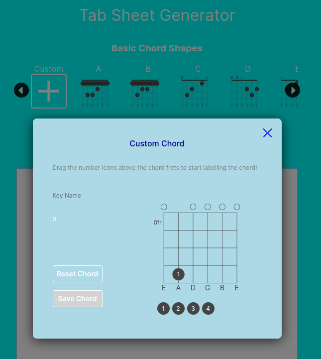

# chords-editor

This project provides a easy way for the user to generate a PDF consisting of chords for the song of their choice. 
The user clicks on the available chords on the top to add chord to the white template below.

Run `npx prettier . --write` to format files in the Home Directory to format all files within the project.

# Add Custom Chords

You can add your own chords to the gallery using the chord editor on the leftmost button of the gallery. 
Drag the finger icons above any fret on the chord image to label that fret.
Save the chord and the new custom chord will next to the chord editor button. 

